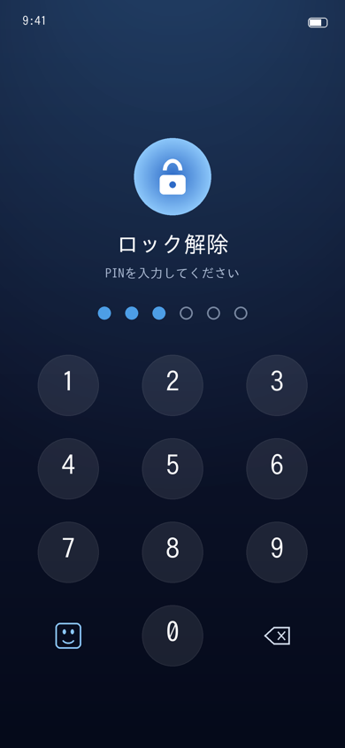

# プライベートメモ (PrivacyVault)

端末内で完結する、暗号化プライバシー保管アプリ（iOS / SwiftUI）。
メモをローカルで暗号化し、PIN と生体認証（Face ID / Touch ID）で保護します。
クラウド送信・アカウント登録・トラッキングは一切ありません。



## 主な機能

- **PINロック** — 6桁PINで解錠。PIN・平文はどこにも保存しません。
- **端末内暗号化** — メモは AES-GCM で暗号化し、鍵は PIN から PBKDF2 (HMAC-SHA256, 20万回) で導出。
- **生体認証** — Face ID / Touch ID で解錠（有効化時、鍵は生体認証付き Keychain に格納）。
- **タグ & 検索** — メモにタグを付与し、キーワード検索・タグでの絞り込みが可能。
- **フォルダ / ピン留め / 並び替え** — フォルダ分け、スワイプでピン留め、更新順・タイトル順の切り替え。
- **iCloud同期（暗号化）** — 暗号文のまま CloudKit プライベートDBへ同期。同じPINの端末どうしで内容を共有。
  削除はトゥームストーンで伝播するため、別端末から消したメモが復活しません。
- **自動ロック（猶予設定）** — 即時 / 1分後 / 5分後を選択。非アクティブ時は目隠し画面でアプリスイッチャーからの覗き見を防止。
- **総当たり対策** — 誤PIN 5回超で段階的に待機（30秒→60秒→…最大1時間）。任意で「10回失敗＝全消去」。
- **暗号化バックアップ** — パスフレーズで暗号化したファイルを書き出し／読み込み。機種変更時の移行に。
- **リッチメモ** — チェックリスト（進捗表示付き）と画像添付（縮小してメモと一緒に暗号化）。
- **日本語 / 英語** — String Catalog による2言語対応（端末の言語設定に追従、未訳は日本語表示）。
- **ウィジェット** — 件数のみ表示（内容は出さない）。ホーム画面から素早く解錠へ。
- **共有拡張** — 他アプリのテキスト／URLを「保存」→ 本体の**公開鍵で封をして**受信箱へ。開封は本体アプリの秘密鍵でのみ可能。
- **おとりPIN（デュレス保護）** — 本来のPINとは別のPINで、切り離された保管庫を開く。
  PINの開示を強要された場合などに本来の内容を守るための、一般的なセキュリティ機能です。
  おとり側には当たり障りのない初期メモが入っており、空で不自然に見えることを防ぎます。
- **緊急ワイプ** — 全保管庫・鍵（同期済みなら iCloud のレコードも）をワンタップで完全削除。

## 拡張ターゲット（ウィジェット / 共有拡張）

`project.yml` に3ターゲットを定義しています（本体 / ウィジェット / 共有拡張）。
いずれも **App Group `group.com.example.privacyvault`** を共有します。

- **ウィジェット**は App Group の共有領域から「件数」だけを読みます（本文は保存していません）。
- **共有拡張**は本体アプリの **X25519 公開鍵**（App Group 経由で公開）で下書きを封をして
  受信箱に置くだけです。復号鍵（秘密鍵）は本体アプリの Keychain にのみ保管され、拡張からは触れません。
  本体アプリは解錠時に受信箱を開封し、暗号化保管庫へマージします。
- Xcode で各ターゲットの Signing & Capabilities から App Group を有効化し、
  ID を自分のもの（`group.<あなたのBundleID>`）に合わせてください。

## テスト

同期マージ・ロックアウト・自動ロック・バックアップ形式・リッチメモ・共有受信箱・
後方互換の純粋ロジックにはユニットテストがあります（Xcode不要、`swiftc` があれば実行可能）:

```bash
sh Tests/run-tests.sh   # 60 assertions
```

デザインは、アイコンのシールド/キーホールと同系統のディープネイビー × ティールブルーで統一しています
（`Sources/App/Theme.swift`）。

## セキュリティ設計

| 保存物 | 保存先 | 保護 |
|---|---|---|
| PBKDF2ソルト / 検証トークン | Keychain | `WhenUnlockedThisDeviceOnly`、端末外に出ない |
| 生体認証用の鍵 | Keychain | `.biometryCurrentSet` + `WhenPasscodeSet` |
| メモ本体（暗号文） | App Support 内ファイル | AES-GCM + `completeFileProtection` |
| PIN / メモ平文 | **保存しない** | — |

- PINの照合は「検証トークンを復号できるか」で判定するため、PINやそのハッシュを保持しません。
- primary / decoy それぞれ独立したソルト・鍵・暗号文を持ち、ストレージ上は区別されません。
- iCloud には **暗号文のみ** を送信します。鍵は端末外に出ないため、iCloud側では復号できません。

### iCloud同期について

- 種別（primary/decoy）ごとに1レコード（`VaultBlob`）を CloudKit プライベートDBへ upsert します。
- マージは **item単位の last-writer-wins**（`updatedAt` が新しい方を採用）。
- 削除は **トゥームストーン**（削除ID+削除時刻）として90日間保持・同期されるため、
  別端末の古い blob からメモが復活することはありません。
  削除後に別端末でそのメモが編集されていた場合は、新しい編集の方が勝ちます。

## ビルド方法

Xcode プロジェクトは [XcodeGen](https://github.com/yonaskolb/XcodeGen) で生成します。

```bash
brew install xcodegen      # 未導入なら
xcodegen generate          # project.yml から PrivacyVault.xcodeproj を生成
open PrivacyVault.xcodeproj # Xcode で開く
```

Xcode で:

1. `PrivacyVault` ターゲットの **Signing & Capabilities** で自分の Team を選択（Bundle ID は必要に応じて変更）。
2. **iCloud（CloudKit）** を使う場合:
   - Capabilities に iCloud を追加し、CloudKit にチェック。
   - コンテナ `iCloud.<あなたのBundleID>` を作成し、`project.yml` / エンタイトルメントのコンテナIDを合わせる。
   - `VaultBlob` レコードtype（`blob`: Asset フィールド）は開発環境では初回保存時に自動作成されます。
     本番運用前に CloudKit Dashboard で Production スキーマへデプロイしてください。
3. 実機を選んで Run（生体認証はシミュレータでは限定的。Features > Face ID で疑似操作可）。

## App Store への申請メモ

- `NSFaceIDUsageDescription` は設定済み（`project.yml`）。
- `ITSAppUsesNonExemptEncryption = false`（標準の暗号のみ使用）を設定済み。用途に応じて輸出コンプライアンスの申告を確認してください。
- 1024×1024 のアプリアイコンは設定済み（`Assets.xcassets/AppIcon.appiconset`）。
- **提出用の説明文・キーワード・プライバシー申告・審査メモ・スクリーンショットは
  [`docs/appstore/SUBMISSION.md`](docs/appstore/SUBMISSION.md) にまとめてあります。**

## 動作環境

- iOS 16.0 以上
- Swift 5 / SwiftUI

## ディレクトリ構成

```
Sources/
  App/        アプリ入口・状態管理・配色 (AppState, RootView, Theme)
  Security/   暗号・Keychain・生体認証
  Storage/    保管庫の永続化・iCloud同期 (VaultManager, FileStore, CloudSyncService)
  Models/     データモデル・おとり初期メモ
  Views/      画面 (ロック / 一覧 / 編集 / タグ / 設定)
  Resources/  Assets(アイコン), 生成Info.plist/entitlements
```
